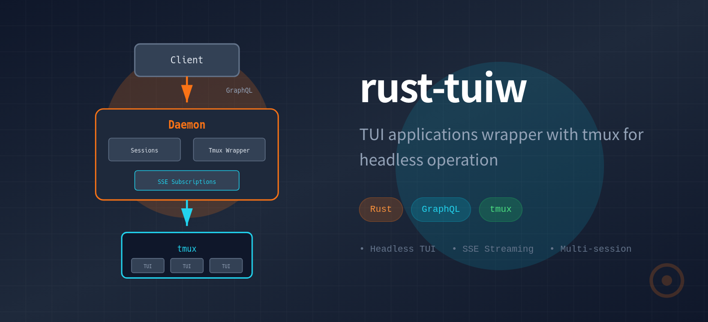

# tuiw

[](https://crates.io/crates/tuiw)
[](https://docs.rs/tuiw)
[](https://github.com/conao3/rust-tuiw/blob/master/LICENSE)



TUI applications wrapper with tmux for headless operation.

## Overview

rust-tuiw enables headless interaction with TUI (Terminal User Interface) applications by wrapping them with tmux. This allows for programmatic control and automation of interactive terminal applications.

## Getting Started

### Prerequisites

- Rust toolchain (1.91.1 or later)
- tmux
- NixOS users: Use `nix develop` for development environment

### Installation

Install via crates.io.

```bash
cargo install tuiw
```

or install via nixpkgs.

```bash
nix shell github:conao3/rust-tuiw
```

or install from source.

```bash
git clone https://github.com/conao3/rust-tuiw.git
cd rust-tuiw
cargo build --release
./target/release/tuiw --help
```

### Basic Usage

#### 1. Create a Session

Create a new TUI session by specifying the command to run:

```bash
tuiw create "bash"
```

This will output a session ID (8 character hex format):
```
Session created: 2a638ef5
```

You can also specify a working directory:

```bash
tuiw create "vim" --cwd /path/to/project
```

#### 2. List Sessions

View all active sessions:

```bash
tuiw list
```

Output:
```
Sessions:
  2a638ef5 - bash (/home/user)
```

#### 3. Send Keys

Send keyboard input to a session:

```bash
tuiw send 2a638ef5 "echo hello"
tuiw send 2a638ef5 "Enter"
```

#### 4. Get Output

Capture the current screen content:

```bash
tuiw output 2a638ef5
```

#### 5. Check Status

Check if a session is running:

```bash
tuiw status 2a638ef5
```

#### 6. Close Session

Terminate a session:

```bash
tuiw close 2a638ef5
```

### Example: Automating vim

```bash
# Create a vim session
SESSION_ID=$(tuiw create "vim" | grep -oE '[0-9a-f]{8}')

# Open a file
tuiw send $SESSION_ID ":e test.txt"
tuiw send $SESSION_ID "Enter"

# Enter insert mode and type
tuiw send $SESSION_ID "i"
tuiw send $SESSION_ID "Hello, World!"

# Save and quit
tuiw send $SESSION_ID "Escape"
tuiw send $SESSION_ID ":wq"
tuiw send $SESSION_ID "Enter"

# Close session
tuiw close $SESSION_ID
```

### SSE for Real-time Monitoring

Subscribe to screen changes via Server-Sent Events:

```bash
curl -N http://127.0.0.1:50051/sse/2a638ef5
```

This streams output whenever the screen content changes.

### GraphQL API

The daemon exposes a GraphQL API at `http://127.0.0.1:50051/graphql`:

```bash
curl -X POST http://127.0.0.1:50051/graphql \
  -H "Content-Type: application/json" \
  -d '{
    "query": "query { listSessions { id command cwd } }"
  }'
```

### Troubleshooting

**Daemon not starting:**
- Check if port 50051 is available
- Ensure tmux is installed and in PATH

**Session not found:**
- The daemon is stateless and sessions are lost on restart
- Verify the session ID is correct using `tuiw list`

**Keys not being sent:**
- Ensure the session is still running with `tuiw status`
- Special keys like Enter, Escape, Tab should be sent as separate commands

## Architecture

### Daemon/Client Model

The application operates in two modes:
- **Daemon**: GraphQL server that manages tmux sessions and TUI applications
- **Client**: CLI interface that communicates with the daemon via GraphQL

On first invocation, if no daemon is running, the process automatically starts as a daemon. Subsequent invocations act as clients.

### Components

```
┌─────────────────────────────────────────────────────────┐
│                        Client                           │
│                     (GraphQL Client)                    │
└──────────────────────┬──────────────────────────────────┘
                       │ GraphQL over HTTP
                       │ SSE for subscriptions
┌──────────────────────▼──────────────────────────────────┐
│                       Daemon                            │
│                   (GraphQL Server)                      │
│  ┌─────────────────────────────────────────────────┐   │
│  │          Session Management (in-memory)         │   │
│  │  - Session ID generation                        │   │
│  │  - CWD tracking                                 │   │
│  │  - Multiple session support                     │   │
│  └─────────────────────┬───────────────────────────┘   │
│                        │                                │
│  ┌─────────────────────▼───────────────────────────┐   │
│  │           Tmux Wrapper                          │   │
│  │  - Session creation                             │   │
│  │  - Key input injection                          │   │
│  │  - Output capture (capture-pane)                │   │
│  │  - Change detection for SSE                     │   │
│  └─────────────────────┬───────────────────────────┘   │
└────────────────────────┼───────────────────────────────┘
                         │
                ┌────────▼────────┐
                │  Tmux Sessions  │
                │   ┌──────────┐  │
                │   │   TUI    │  │
                │   │   App    │  │
                │   └──────────┘  │
                └─────────────────┘
```

### GraphQL API

#### Mutations
- `createSession(command: String!, cwd: String!): SessionID`
- `sendKeys(sessionId: SessionID!, keys: String!): Boolean`
- `closeSession(sessionId: SessionID!): Boolean`

#### Queries
- `listSessions: [Session!]!`
- `getOutput(sessionId: SessionID!): String!`
- `getSessionStatus(sessionId: SessionID!): SessionStatus!`

#### Subscriptions
- `screenChanges(sessionId: SessionID!): String!` (via SSE)

### Session Management

Each session maintains:
- Unique session ID (8 character hex string derived from UUID)
- Working directory (cwd) from client invocation location
- Tmux session reference
- Output buffer and change detection state

Multiple TUI applications can run simultaneously, each in its own session.

## Use Cases

### Primary: Claude Code Automation

Claude Code currently lacks a headless interaction mode. By wrapping Claude Code with rust-tuiw, you can:
- Programmatically send commands
- Monitor output changes
- Automate coding workflows

### General TUI Automation

Since rust-tuiw works with any TUI application, it enables automation for:
- All coding agents (not just Claude Code)
- Interactive CLI tools
- Terminal-based development environments
- Any ncurses/TUI application

## Technology Stack

- **Language**: Rust (edition 2024)
- **Async Runtime**: tokio
- **GraphQL**: async-graphql
- **HTTP Server**: axum
- **CLI Parsing**: clap
- **Process Management**: tmux

## Development

See `Makefile` for available commands:
- `make build` - Build the project
- `make run` - Run the application
- `make test` - Run tests
- `make check` - Run cargo check
- `make clippy` - Run clippy lints
- `make fmt` - Format code

## License

Apache-2.0
